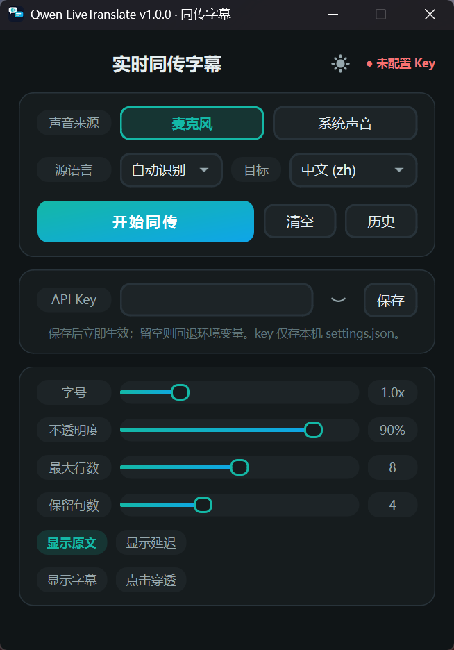
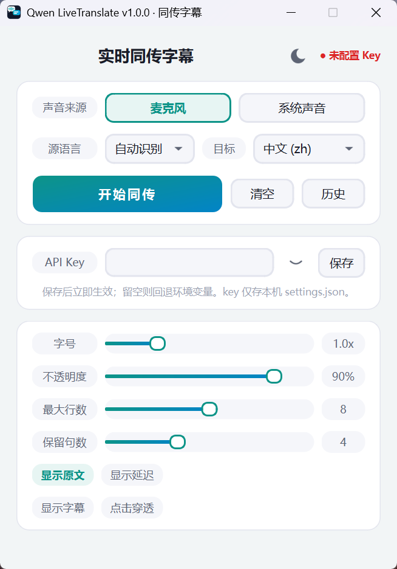

# Qwen LiveTranslate

**English** | [简体中文](./README.md)

---

[](./LICENSE)
[]()
[]()
[]()
[](../../actions/workflows/ci.yml)

A real-time bilingual caption tool built on the **Qwen3.8-LiveTranslate-Flash-Realtime** model (DashScope WebSocket API). It renders as a **graphical console + always-on-top translucent overlay** showing source text and translation side by side — supporting both microphone and system-audio capture, continuous paragraph-style captions, dark/light themes, and live appearance tuning.

> Typical uses: real-time bilingual subtitles for foreign-language videos/meetings, classroom interpretation aid, or as an OBS/streaming caption bar. Windows only (system-audio capture relies on WASAPI loopback).

**Dark / Light themes:**

|  |  |
|:---:|:---:|
| Dark (default) | Light |


## Features

| Capability | Details |
|---|---|
| **Self-healing connection** | Auto-reconnects on unexpected disconnect (backoff 5s/15s/45s, 3 attempts); captions preserved during reconnect; falls back to a visible error after exhaustion. Multi-screen aware |
| Real-time interpretation | Speech → source transcript (ASR) → translation, streamed bilingually |
| Floating captions | Translucent rounded always-on-top window; draggable; click-through toggle via `Ctrl+Alt+Space` |
| **Edge resize** | Drag left/right edges to resize width, bottom/corner for height (WYSIWYG, persisted on release; double-click restores auto height) |
| Caption trimming | `display_sentences` slider (1–10): sentences merged into paragraphs (CJK seamless, smart spacing for Latin), oldest trimmed beyond the limit |
| Dual themes | Dark/light via title-bar sun/moon toggle; teal→sky accent gradient, cool-neutral palette; overlay stays dark for readability over video |
| Console | Source (mic / system audio), source language (auto / de / en / zh / ja / fr / es / ru) & target language; one-click start/stop with live status |
| Key management | Paste & save key in-console (stored locally in settings.json; falls back to `DASHSCOPE_API_KEY` env var) |
| History | SQLite storage per final sentence (time/languages/original/translation/latency); double-click row to copy; one-click CSV export (UTF-8-BOM) |
| Hotkeys | See table below |

## 1. Get an API Key (paid model, rate-limited)

1. Open https://bailian.console.aliyun.com/ (Alibaba Cloud Bailian, a.k.a. DashScope)
2. Sign up / log in → **API-KEY** → **Create** → copy the `sk-` key
3. The model is billed per call; rate limits: RPM 10 / TPM 100K

## 2. Requirements

| Requirement | Detail |
|---|---|
| OS | Windows 10/11 (system audio uses WASAPI loopback) |
| Python | 3.10+ (not needed for the exe) |
| Network | Access to `dashscope.aliyuncs.com` |

```powershell
pip install -r requirements.txt
```

## 3. Run

### Option A: exe (recommended)
Download `QwenLiveTranslate.exe` from [Releases](../../releases) (single file, no Python needed).
- Prerequisite: `DASHSCOPE_API_KEY` set via `setx` (user-level is fine)
- First launch is a few seconds slower (self-extracting); settings.json lives next to the exe
- To move machines: copy the exe + set the key on the new machine

### Option B: Python script
Double-click `start.bat`, or run `python main.py`.

### Build the exe from source
```powershell
pip install pyinstaller
pyinstaller --noconfirm --clean --onefile --windowed --name QwenLiveTranslate --add-data "config.py;." --add-data "theme.py;." --add-data "app.ico;." --icon app.ico main.py
```

---

After launch:
1. Pick the audio source: `🎤 Microphone` / `🔊 System audio`
2. Pick the target language (de/en/zh/ja/fr/es/ru)
3. Click **Start** → the caption overlay appears (key can also be pasted into the console's API Key field instead of setx)
4. Tune appearance live: font scale / opacity / line sliders, show-original & latency toggles, click-through button (resize by dragging overlay edges)
5. Closing the console window exits everything

## 4. Tips & Hotkeys

**Global hotkeys (available while running):**

| Hotkey | Action |
|---|---|
| `Ctrl+Alt+Space` | Toggle caption **click-through** |
| `Ctrl+Alt+B` | Show/hide caption window (session kept) |
| `Ctrl+Alt+Backspace` | Clear captions (current + history) |
| `Ctrl+Alt+S` | Switch audio source mic ↔ system audio (auto-reconnects) |

**Typical scenarios:**

- **Bilingual subtitles for videos**: source = *System audio*, target = *Chinese* → original + Chinese translation side by side
- **Classroom/meeting aid**: source = *Microphone* or *System audio*; enable *Show latency* to observe responsiveness
- **Watch & work**: position the bar, hit `Ctrl+Alt+Space` — captions float above without blocking interaction
- Changing source/language while running **auto-reconnects** (RPM 10 — don't spam)

## 5. Troubleshooting

| Symptom | Fix |
|---|---|
| "Key not set" | `setx DASHSCOPE_API_KEY "sk-xxx"` (open a **new** terminal afterwards); or paste into the console's Key field |
| Connect/session timeout | Check network & key validity; RPM 10 — avoid rapid restarts |
| No captions | Check the console's key dot is green and the session shows "ready"; speak into the mic (mic mode) or make sure audio is actually playing (system-audio mode); if still nothing, Stop → Start to reconnect |
| Capture failure | Run `python capture.py --list-devices` (Bluetooth headsets must be connected to appear in loopback list) |

## 6. Project Layout

```
qwen-livetranslate/
├── main.py              # Entry: launches the console
├── console.py           # Graphical console (source/lang/start-stop/appearance/history)
├── controller.py        # Session controller (capture+WS+push lifecycle, auto-reconnect)
├── realtime_client.py   # WebSocket protocol layer (qwen3.8 event routing)
├── capture.py           # Audio capture (mic / loopback + resampling)
├── overlay.py           # Caption overlay (streaming, trimming, geometry memory, click-through)
├── history.py           # History storage (SQLite, thread-safe, CSV export)
├── history_view.py      # History window (table/copy/export/clear)
├── settings.py          # settings.json persistence
├── config.py            # Static config (endpoint/audio/hotkeys/version)
├── theme.py             # Theme engine (tokens + QSS + geometric icons)
├── make_icon.py         # App icon generator (Pillow, re-runnable)
├── app.ico              # App icon
├── QwenLiveTranslate.spec  # PyInstaller config
├── start.bat            # Double-click launcher
├── tests/               # pytest suite (offscreen, no devices needed)
├── sample_16k.wav       # E2E test samples
├── e2e_*.txt            # E2E verification logs
├── requirements.txt     # Runtime deps
├── LICENSE / CONTRIBUTING.md / CODE_OF_CONDUCT.md / CHANGELOG.md
└── .github/             # CI workflow + issue templates
```

## 7. Protocol Notes (qwen3.8-livetranslate-flash-realtime)

- Endpoint: `wss://dashscope.aliyuncs.com/api-ws/v1/realtime?model=qwen3.8-livetranslate-flash-realtime`
- Auth: `Authorization: Bearer $DASHSCOPE_API_KEY`
- Session: `session.update {output_modalities:["text"], translation:{language:...}, audio:{output:{voice:"Tina"}}}` (3.8 uses `output_modalities`; 3.5 uses `modalities`; **voice must be explicit** — default Chelsie returns 400)
- Audio: `input_audio_buffer.append {audio: base64(16kHz/16bit/mono PCM)}` at 100ms/frame
- Source: `conversation.item.input_audio_transcription.delta/.completed` (3.8 = `.delta` family; 3.5 = `.text`)
- Translation: `response.text.delta` → `response.text.done` (text modality)
- Teardown: `session.finish` → wait `session.finished` → close

## Development

```powershell
pip install -r requirements.txt -r requirements-dev.txt
pytest tests/ -q   # offscreen; no audio devices or API key needed
```

See [CONTRIBUTING](./CONTRIBUTING.md) for conventions and PR workflow.

## License

[MIT](./LICENSE) © 2026

## Privacy

- API keys stay on your machine (env var or local settings.json); connections go directly to Alibaba Cloud DashScope — no third-party servers
- Translation history is stored in local SQLite only, never uploaded
- Audio is streamed to DashScope for recognition/translation in real time, never written to disk

## Changelog

See [CHANGELOG](./CHANGELOG.md).
